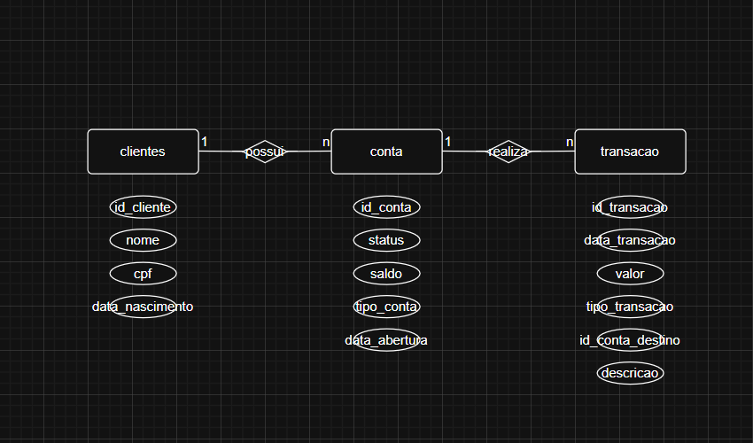
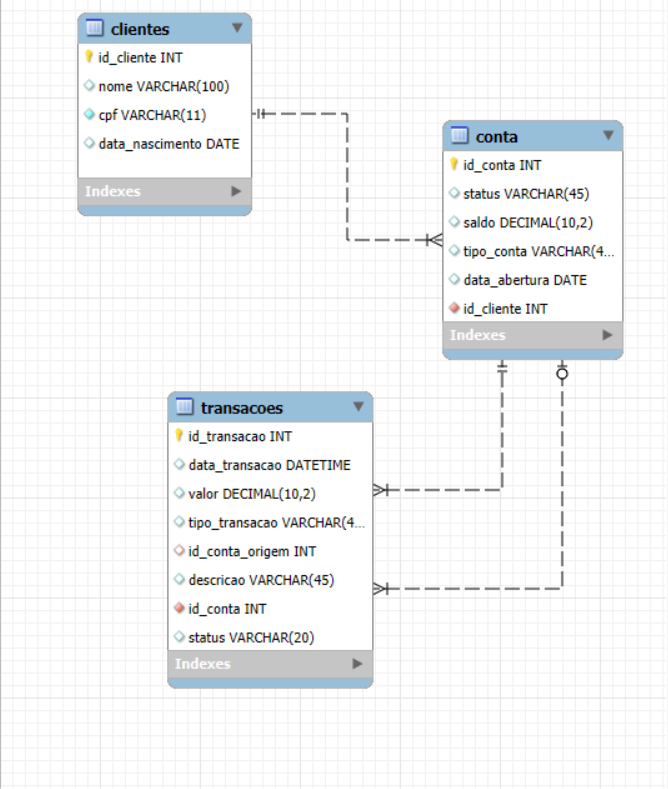

# 🏦 Projeto de Banco Digital: Auditoria e Arquitetura Relacional

Este repositório documenta a evolução do meu aprendizado em Banco de Dados, partindo de conceitos fundamentais de governança até a resolução de um **case técnico real de mercado**.

> **Nota de Histórico:** Este portfólio integra o meu aprendizado inicial com a minha evolução atual, demonstrando a base sólida que permitiu o desenvolvimento deste [Projeto de Banco Digital].

---

## 🎯 O Desafio (Baseado em Case do JPMorgan / StrataScratch)
O alicerce técnico deste projeto foi fundamentado em uma requisição real de auditoria para o **Bank of Ireland**, que exigia a detecção de transações inválidas ocorridas em dezembro de 2022.

**Regra de Negócio para Auditoria:**
Uma transação é considerada inválida se ocorrer fora do horário normal de operação:
- **Segunda a Sexta:** Fora do intervalo 09:00 - 16:00.
- **Sábados e Domingos:** Fechado.
- **Feriados Bancários:** 25 e 26 de Dezembro.

---

## 🛠️ Etapas do Desenvolvimento

### 1. Modelo Conceitual (Abstração)
Representação de alto nível utilizando o Diagrama Entidade-Relacionamento (DER).

### 2. Modelo Lógico (Estruturação)
Tradução do conceito para tabelas e colunas, definindo tipos de dados e Chaves Estrangeiras (FK) para garantir a integridade referencial.

### 3. Implementação Técnica (SQL)
O projeto está modularizado para garantir as melhores práticas de desenvolvimento:
- `sql/01_schema.sql`: Estrutura de tabelas e constraints.
- `sql/02_inserts.sql`: Dados de teste para validação das regras.
- `sql/03_views.sql`: **Camada de Auditoria e Inteligência.**

---

## ✨ Diferenciais e Destaques Técnicos
Neste projeto, não apenas repliquei dados, mas apliquei lógica de alta fidelidade:

* **Auditoria Automatizada (Case JPMorgan):** Implementação da View `v_auditoria_fraude` que filtra automaticamente transações que violam os horários de operação bancária, identificando falhas de conformidade.
* **Tratamento de Dados Inativos:** Uso de `LEFT JOIN` com `IFNULL` para reportar clientes cadastrados sem movimentação (Análise de Conversão).
* **Integridade de Fluxo:** Estrutura de **Dupla Chave Estrangeira** (`origem` e `destino`) para assegurar a consistência das transações financeiras.
* **Pronto para BI:** Views criadas para entregar dados já tratados para ferramentas como Power BI ou Tableau.

---

## 📂 Estrutura de Arquivos
- `/diagramas`: Imagens dos modelos conceitual e lógico.
- `/sql`: Scripts estruturados de criação, inserção e análise.

---

## 📈 Conclusão
Este projeto prova o meu domínio sobre a semântica de dados e a resolução de problemas de negócio complexos. 
*Aprovado com 94% de aproveitamento na disciplina de Modelagem Relacional (Uninter).*